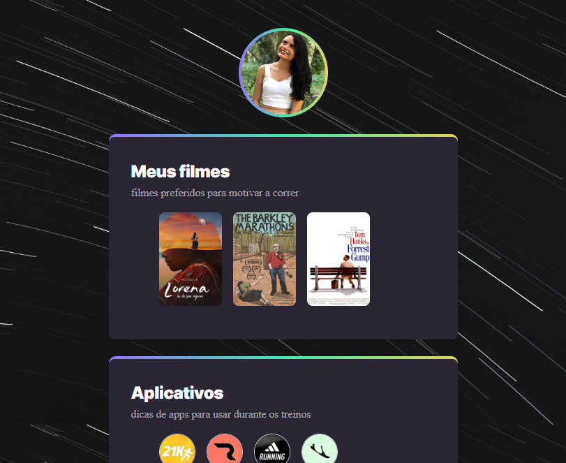

# NLW eSports

> Explorer 

Project realized during Rocketseat's Next Level Week event.

🔗 [Click here to access](https://carvmi.github.io/nlwesports/)

## Technologies 
- HTML
- CSS
- Git and Github

## What I have learned
- set css transition using hover and transform property on scale 
- set css animation using nth=child, transform property on translateY or X on keyframes
- set gradient border using "background-image: linear-gradient", because divs don't have text properties
- use "display:flex" to keep elements side by side 

## Contact
milenadecarvalho2000@gmail.com
